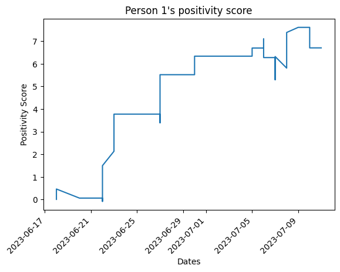
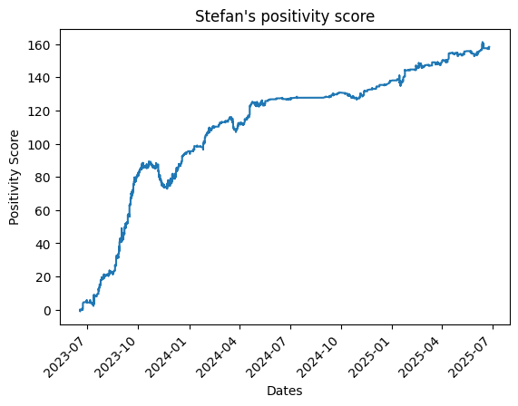

# Sentiment Analysis of WhatsApp Chats

A lightweight Python toolchain that takes an exported WhatsApp chat `.txt` file, validates and stitches together multi-line messages, runs VADER sentiment scoring on each message, and produces per-user sentiment‐over-time charts.

---

## Usage

There’s also an example notebook (`candlestick_2.ipynb`) showing end‐to‐end usage. In code you can do:

```python
# To validate the WhatsApp text, run the following function.
# Provide a path to the file you wish to validate.
# The result will be a path to the validated file.
validated_filee = data_validation("/content/data‐snippet.txt")

# Use the result from above to generate a dictionary containing users and sentiment scores.
sentiment_dict = sentiment_analysis(validated_filee)

# Use the dictionary to create sentiment charts for each group member.
get_charts(sentiment_dict)
```

## Example Output

We include an example chat export under `examples/data‐snippet.txt` and two sets of output charts:

- **Small sample** (<700 messages):  
  
  Sentiment curves for each of the three participants over a handful of days.

- **Larger dataset** (≈7,000 messages):  
    
  With more data, the trends smooth out and become more insightful—so we recommend running on as much chat history as is available.

## Dependencies

This project relies on:

```text
# Standard Library (built-in to Python)
collections            # defaultdict
datetime               # date, datetime
dateutil               # parser
logging                # logger
ntpath
time
re
os

# Third-party (install via pip)
nltk                   # SentimentIntensityAnalyzer, VADER lexicon
matplotlib             # plotting
numpy                  # array operations
python-dateutil        # dateutil parser

# Jupyter notebook setup (optional)
nltk.download('vader_lexicon')
%matplotlib inline
```

## Licensing

- **Code:** MIT License (`LICENSE`)
- **Example chat data:** CC BY-NC-ND 4.0 (`examples/data-snippet-license.txt`)

The example conversation in `examples/data-snippet.txt` is licensed under Creative Commons Attribution-NonCommercial-NoDerivatives 4.0 International. You may share it for non-commercial/demo purposes **only**, provided you:

1. **Attribute** [@The-Stef](https://github.com/The-Stef).  
2. **Do not use** it for commercial purposes.
3. **Do not distribute** modified versions.

See `examples/data-snippet-license.txt` for the full legal text.